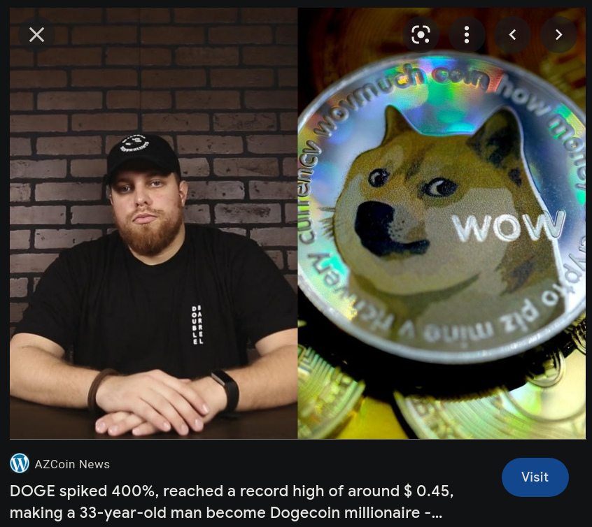

## The Year Of Crypto

 
 
 
 
 
 
 
 
 
 
 
 
 
 
 

## That's what I thought in 2017

 
 
 
 
 
 
 
 
 
 
 
 
 
 
 

## Slum Doge Millionaire

 
 
 
 
 
 
 
 
 
 
 
 
 
 
 

## Now you have me talking to you about crypto
Just excuse the lambo.

### Why am I doing this?
I am not going to sell you on anything.  I am not going to tell you that crypto
is 100% the future.  I have no idea what the future will be and crypto is a
very interesting topic to say the least.  From a personal stand point, I think
its just interesting.  I think every developer should at least play with it and
see how it goes.

 
 
 
 
 
 
 
 
 
 
 
 
 
 
 

### The goal of this course
The goal of this course is not to teach you something specific about a specific
platform, but instead to give you the foundation it requires to build
_anything_ you want on with ethereum.

There are plenty of other cool technologies out there that could easily be
used.  I personally am very excited about building something with solona.  I
think that it could be a real winner.

#### The Course Outline.
##### P1. The Foundation
* The "Hello, Universe" contract.
  * building a `HelloWorld` contract.
  * Testing It
  * Deploying it.
  * Communicating from the browser.

##### P2. Understanding Solidity
* A slightly more complex contract with reading and writing.

##### P3. Complex Contract
* Core concepts.
  * Arrays
  * Mappings
  * Bits
    * (0x1 << 3) - 1
    * We will get you good at bits.
  * Testing, Deploying, Communicating.

##### P4. Memory, Fallbacks -> Diamond Pattern
* Things we will a bit complicated here.  But it is a must for any developer.

##### P5. Advanced Testing Techniques
* This will help with development of contracts that rely on 3rd parties.

 
 
 
 
 
 
 
 
 
 
 
 
 
 
 

### Ready?
This does mean we will make a contract before we even understand ANYTHING that
is happening.  This is ok.  Just go with it and try to draw boxes and arrows.
 
 
Lastly, I assume you understand programming.
 
 
We will be hopping between many technologies and moving fast.

 
 
 
 
 
 
 
 
 
 
 
 
 
 
 

